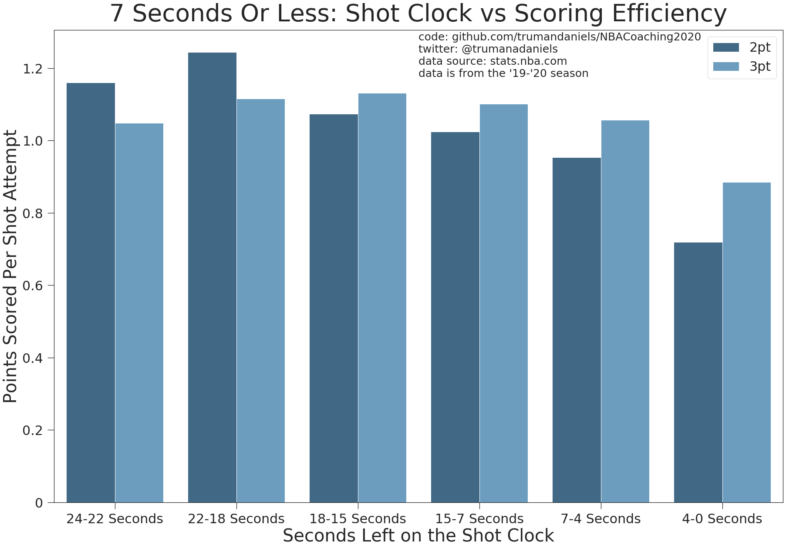
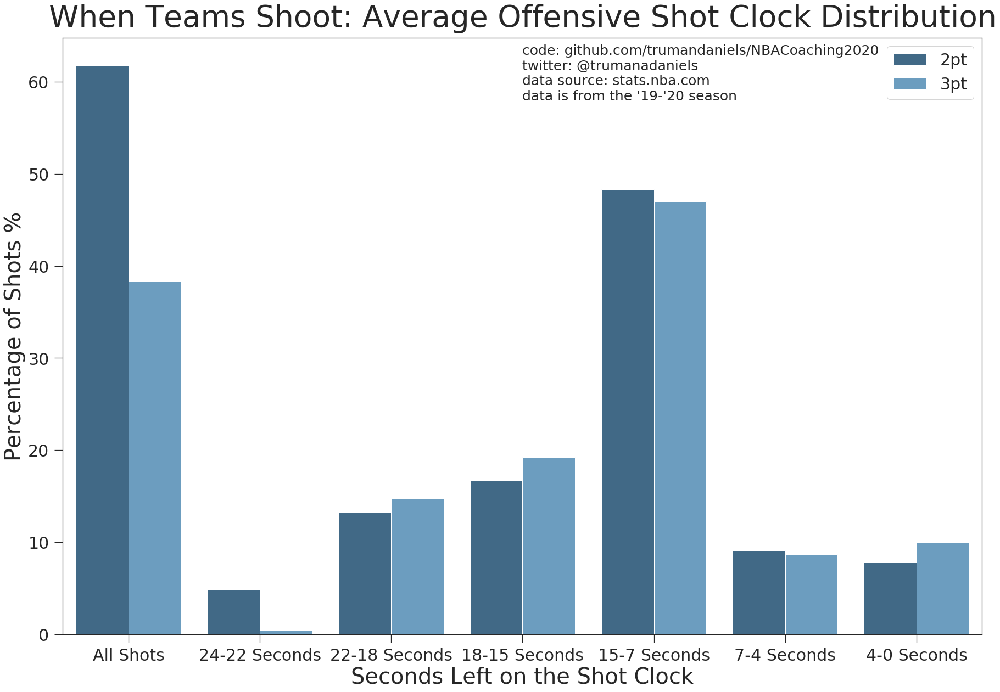
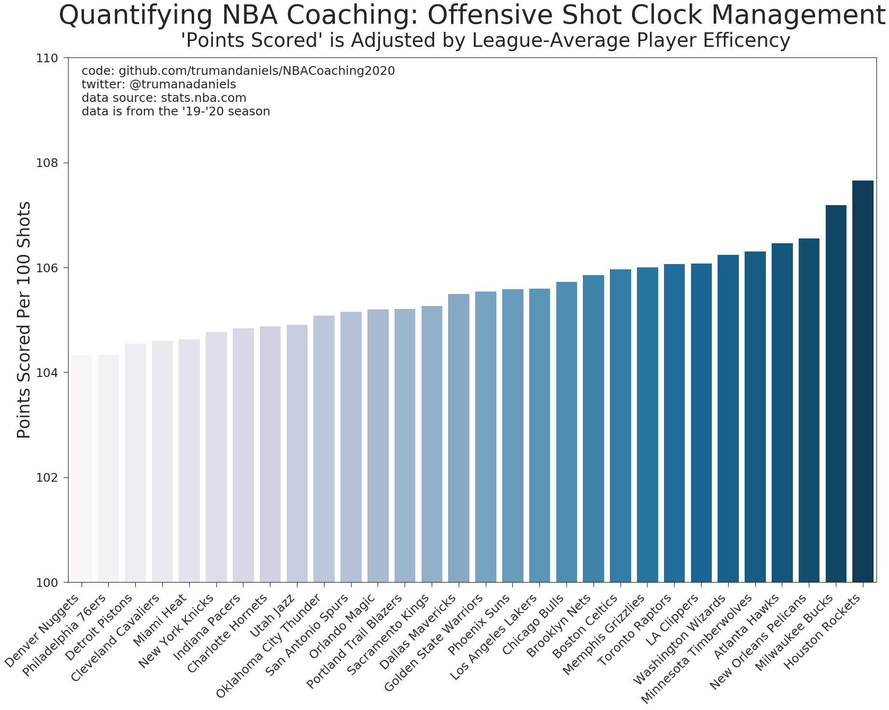
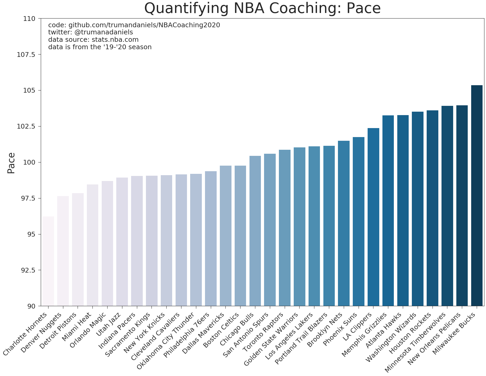
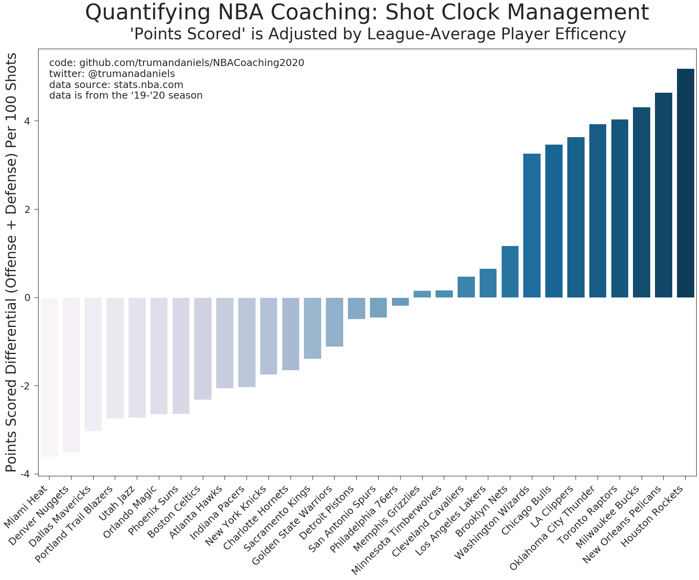

# NBA Analytics: Quantifying NBA Coaching Impact 

### Evaluating NBA coaches is hard. 

During the 2015-2016 season, GSW coach Steve Kerr was recovering from back surgery so assistant coach Luke Walton took over head coaching duties and lead the Warriors to a blazing 39-4 start.

The next year Walton took the head coaching job of the Lakers, leading the team to a record of 26-56. What happened? Walton's coaching didn't drasticly change. 

Obviously, what changed were the rosters. The Warriors had four likely Hall of Famers; three of their players are in the conversation for best shooter of all time. The Lakers on the other hand--a young, rebuilding team with a handful of past-their-prime veterans--didn't stand a chance vs most teams. 

Distinguishing the difference between a good coach and a bad coach is not easy. The only stats tracked about coaches is how old they are and what their win-loss record is; the Luke Walton anecdote shows how misleading it can be to only look at wins and losses. Box scores don't keep track of how loud the coach is, or the timeliness of his or her time outs.  

Coaches do many things, some of which are unmeasurable. They lead the locker room and keep the team happy and cohesive. Basketball is a **team** sport after all. Coaches also help develop players' skills like ball handling and shooting. They also have more direct on-court impact: they control things like substitutions, lineups, and matchups. They use their power as the off-court team leader to keep players in check: substitutions give chuckers a consience and encourage scorers to hustle on defence. Coaches design the gameplan, scheme, and plays that put players in the best possible positions to score. 

As well as some people can coach, the players themselves execute the gameplan and actually touch the ball or block a shot. As a fan or decision maker, I want to know if my coach is a good coach because I want my team to win more.

We can boil down which team wins and which team loses into 2 factors:
1. the team with more possessions
2. the team that converts possessions into points more effectively

The former is difficult to parse player value out of. When a player turns the ball over, is that his fault or the coaches fault? When a player steals the ball is that because the coach created a brilliant defensive gameplan or because the player saw the play developing and jumped a passing lane? I want to look into this more, maybe by comparing the consistency of certain team statistics from year-to-year. But for now I'm going to focus on deciphering the coaches impact on the latter. 

At least intuitively, coaches should have significant influence over shot selection, both by getting guys open with well designed plays and by keeping rogue shooters in check. If we remove individual player talent at converting posessions (making shots) and just look at the opportunities it is a way to measure coaching value. These same arguments also apply to the defensive side of coaching, good coaches prevent opposing teams from getting easy looks.

#### This project is an attempt to quantify some aspects of scheme and compare coaches' ability to get players high-quality shots. 

So what is a "good shot" exactly?

Four shot quality factors I found statistics for in the NBA's player-tracking data:
1. Time left on the shot clock
2. Distance to nearest defender
3. Place on the floor (i.e. by the basket vs midrange vs corner 3 vs non-corner 3s)
4. Catch-and-shoot vs off-the-dribble

#### Mike D'antoni and the Seven Seconds or Less Suns:

The Mid 2000's Pheonix Suns lead by Steve Nash and their coach Mike D'antoni were an electric, offensive powerhouse. The Suns pioneered a high-pace, 3pter-heavy style of offense that is incredibly popular today. What makes playing with a high pace so effective is that the defense doesn't get the opportunity to set itself before the offense either attacks the basket or the 3pt line. Players are much more likely to score on a fast break than in a half court set. 

Using the data collected by the web scraping tool I built, we can construct a graph of the average value a 2pt or 3pt has based on how many seconds are left in the shotclock:

As you can see above, teams that are unable to take a shot at the start of the shot clock have their shooting accuracy plummet. So how do teams manage the shot clock on average?

### Quantifying Shot Clock Management

We can then map each team's unique shot clock shot attempts distribution onto the average distribution of outcomes (above) weighting the ratio of 2pters and 3pters to create a new offensive metric. Here is a graph of NBA teams sorted by this metric:

Which appears to be correlated with pace:

The pearson r coefficent was 0.97 (1=perfect correlation, 0=no correlation). So pace and offensive shot clock management are highly correlated. This makes a lot of sense: teams that shoot earlier in the shot clock get more possessions (and hence play at a higher pace) because basketball is a time-limited game. 

We repeat this same process with defensive distributions. Then, we find the difference between offensive shot clock management and defensive shot clock management and get the following graph:

which is my way of evaluating talent ambvilant shot selection.

To be continued with other shot-quality indicators...
